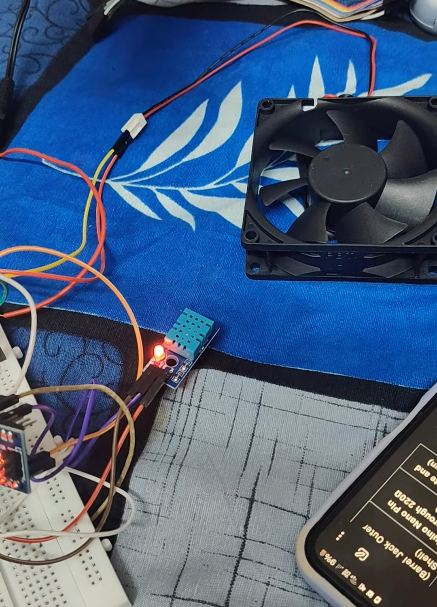

# Smart Fan System using Arduino

## Overview

The **Smart Fan System** is an energy-efficient automation project that controls a fan based on **room temperature** and **human presence**. Using a **DHT11 temperature sensor** and a **PIR motion sensor**, the system automatically turns the fan ON only when:

* A person is present in the room.
* The temperature exceeds a predefined threshold.

This reduces unnecessary power consumption and improves user comfort.

---

## Output




---

## Features

* Automatic fan control based on room temperature.
* Motion detection using PIR sensor.
* Energy-efficient operation.
* Prevents fan operation in empty rooms.
* Simple and low-cost implementation.
* Suitable for smart home applications.

---

## Components Required

| Component                           | Quantity    |
| ----------------------------------- | ----------- |
| Arduino Uno/Nano                    | 1           |
| DHT11 Temperature Sensor            | 1           |
| PIR Motion Sensor (HC-SR501)        | 1           |
| DC Fan                              | 1           |
| MOSFET / Relay Module               | 1           |
| External Power Supply (if required) | 1           |
| Breadboard                          | 1           |
| Jumper Wires                        | As required |

---

## Circuit Connections

### DHT11 Sensor

| DHT11 Pin | Arduino Pin |
| --------- | ----------- |
| VCC       | 5V          |
| GND       | GND         |
| DATA      | D2          |

### PIR Sensor

| PIR Pin | Arduino Pin |
| ------- | ----------- |
| VCC     | 5V          |
| GND     | GND         |
| OUT     | D4          |

### Fan Control

| Component                 | Arduino Pin     |
| ------------------------- | --------------- |
| MOSFET Gate / Relay Input | D3              |
| Fan Power                 | External Supply |
| Fan Ground                | Common Ground   |

---

## Libraries Used

Install the following library from Arduino Library Manager:

* **DHT Sensor Library by Adafruit**

The following library is automatically included:

```cpp
#include <DHT.h>
```

---

## Working Principle

### 1. Temperature Monitoring

The DHT11 sensor continuously measures room temperature.

### 2. Human Presence Detection

The PIR sensor detects motion or human presence inside the room.

### 3. Fan Control Logic

The fan turns **ON** only when:

* Temperature > **30°C**
* Motion is detected (`HIGH`)

Otherwise, the fan remains OFF.

---

## Algorithm

1. Read temperature from DHT11.
2. Read motion status from PIR sensor.
3. Check whether temperature exceeds 30°C.
4. If temperature > 30°C **and** motion is detected:

   * Turn fan ON.
5. Else:

   * Turn fan OFF.
6. Repeat every 2 seconds.

---

## Code Logic

```text
Temperature > 30°C + Motion Detected
                ↓
            Fan ON

Otherwise
                ↓
            Fan OFF
```

---

## Serial Monitor Output Example

```text
Temperature: 32.5 °C | Motion: 1
```

Where:

* `Motion = 1` → Person detected
* `Motion = 0` → No motion detected

---

## Applications

* Smart homes
* Energy-efficient appliances
* Office automation
* Classroom ventilation systems
* IoT-based home automation projects

---

## Future Enhancements

* Variable fan speed control using PWM.
* LCD/OLED display for temperature monitoring.
* Mobile app integration using Bluetooth/Wi-Fi.
* Humidity-based control.
* IoT monitoring with ESP8266/ESP32 and Blynk.

---

## Advantages

✔ Reduces electricity consumption
✔ Improves user comfort
✔ Fully automatic operation
✔ Low-cost implementation
✔ Environment-friendly solution

---

## Team Members

* **Kaviya L**
* **Meris Tiffany GM**
* **Neha Mary Robin**

---

## Project Type

**Engineering Physics Mini Project**
